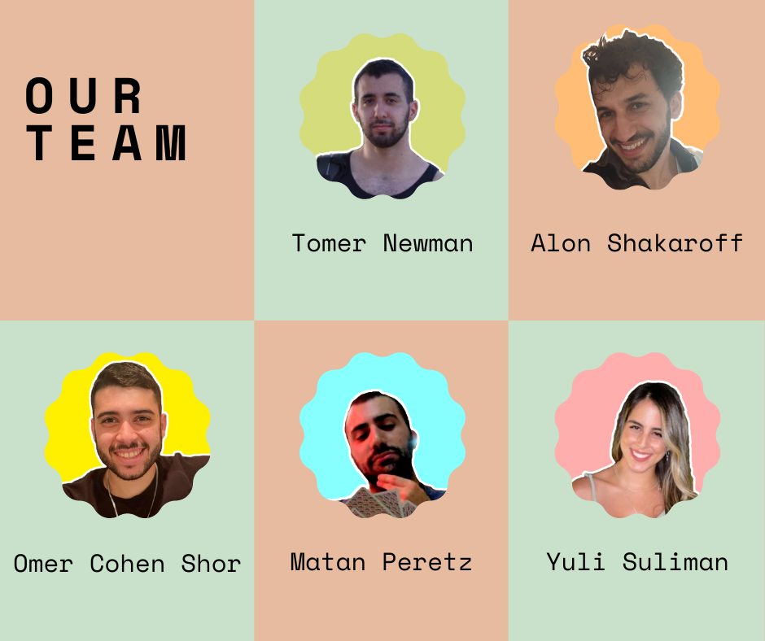

# ResuMe
ResuMe is an open-source platform for students and job seekers that allows users to share their resume for other people to give their intake on it and review it.
# Getting started
These instructions will get you a copy of the project up and running on your local machine.
## Prerequisites
 - Install [Vagrant](https://www.vagrantup.com/downloads).
 - Install [Virtual Box](https://www.virtualbox.org/wiki/Downloads).
## Initializing virtual environment 
1. Clone the [ResuMe](https://github.com/redhat-beyond/ResuMe) repository Using the command `git clone https://github.com/redhat-beyond/ResuMe.git`.
2. Open any terminal and navigate to the project directory.
3. Run the `vagrant up` command
4. Use any browser and navigate to `http://localhost:8000`
# Team members
- [Alon Shakaroff](https://github.com/AlonShakaroff)
- [Omer Cohen Shor](https://github.com/OmerCS8)
- [Tomer Newman](https://github.com/TomerNewmanPrograms)
- [Yuli Suliman](https://github.com/yulisuliman)
- [Matan Peretz](https://github.com/MatanP12)
